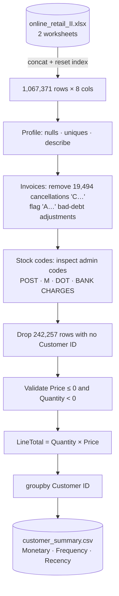

  

  

  
  
  
  
  

---

## 🧠 What I Built

For Assignment 3 of a **Data Engineering bootcamp**, I cleaned the **Online Retail II** dataset (a UK online gift retailer, Dec 2009 – Dec 2011) and transformed raw invoice lines into a **customer-level RFM summary** — the kind of table a marketing team uses for segmentation.

The approach throughout: **inspect the data before trusting the documentation**, make every cleaning decision explicit, and write down the trade-off (each phase ends with a reflection answering *why*).

**My role:** individual assignment — all code, decisions and reflections are my own.

---

## 🔁 Pipeline

| Phase | Decision | Why |
|:-:|---|---|
| 1 | Merge both yearly worksheets, reset index | One continuous table; avoids duplicate index values |
| 2 | Explore invoice formats before cleaning | Found `C` (cancellation) and `A` (bad-debt adjustment) prefixes the docs don't fully describe |
| 3 | Remove **19,494** cancellation lines | The goal is purchasing behaviour, not returns — cancellations would understate spend |
| 4 | Treat admin stock codes as non-products | Postage and bank charges aren't customer purchases (but would stay in a *revenue* report) |
| 5 | Drop **242,257** rows without a Customer ID | RFM is per customer; anonymous lines can't be attributed |
| 6 | Check zero/negative prices (71) and quantities | Giveaways, errors and refunds would distort spend |
| 7 | Compute `LineTotal` before aggregating | Each line contributes its own value; easy to sanity-check |
| 8 | Aggregate per customer | **Monetary** = Σ LineTotal · **Frequency** = unique invoices · **Recency** = days since last purchase, relative to the dataset's latest date (not today) |

### Output preview

| Customer ID | Monetary (£) | Frequency | Recency (days) |
|---|---:|---:|---:|
| 12346 | 77,556.46 | 12 | 325 |
| 12347 | 5,633.32 | 8 | 1 |
| 12348 | 2,019.40 | 5 | 74 |

---

## 🚀 Run It

1. Click **Open in Colab** above (or open the notebook in Jupyter).
2. Download `online_retail_II.xlsx` from the [UCI Machine Learning Repository](https://archive.ics.uci.edu/dataset/502/online+retail+ii) and place it next to the notebook.
3. Run all cells — the notebook writes `customer_summary.csv`.

| File | Contents |
|---|---|
| `Assignment3_Data_Cleaning_Transformation.ipynb` | All 8 phases, code and written reflections |

  

